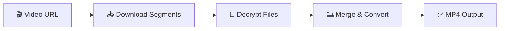

<div align="center">

# Be Engineer Downloader 🎥

<p align="center">
  
  
  
</p>

<p align="center">
  
  
  
  
</p>

**โปรแกรมสำหรับดาวน์โหลดและถอดรหัสวิดีโอจาก Be Online แล้วแปลงเป็นไฟล์ MP4 คุณภาพสูง**

*A powerful tool for downloading and decrypting Be Online video streams, converting them to high-quality MP4 files*

</div>

---

## 🌟 Features | คุณสมบัติ

<table>
<tr>
<td width="50%">

### 🚀 **Core Features**
- 🔄 **Automated Stream Download** - Downloads encrypted TS segments sequentially
- 🔐 **AES-128-CBC Decryption** - Automatic decryption with validation
- 🎬 **MP4 Conversion** - High-quality video output with FFmpeg
- ⚡ **Resume Support** - Continue from specific segments
- 🛡️ **Integrity Checking** - Validates file completeness automatically

</td>
<td width="50%">

### 🎯 **Advanced Features**
- 📊 **Progress Tracking** - Real-time download progress
- 🗂️ **Smart File Management** - Organized cache and output structure  
- 🔧 **Flexible Configuration** - Multiple identifier patterns support
- 📝 **Detailed Logging** - Comprehensive operation logs
- 🧹 **Auto Cleanup** - Automatic cache management

</td>
</tr>
</table>

## 📋 System Requirements | ความต้องการของระบบ

<div align="center">

| Component | Version | Status |
|-----------|---------|--------|
| **Node.js** | `>= 16.0.0` |  |
| **FFmpeg** | `>= 4.0.0` |  |
| **TypeScript** | `>= 4.5.0` |  |
| **Memory** | `>= 1GB RAM` |  |
| **Storage** | `>= 5GB Free` |  |

</div>

## 🚀 Quick Start | การติดตั้ง

> 📖 **Need detailed setup instructions?** Check out our [**Complete Setup Guide**](docs/SETUP.md) for platform-specific installation steps, troubleshooting, and verification.

### 📦 Installation

<details>
<summary><b>🖥️ Step 1: Clone Repository</b></summary>

```bash
# Clone the repository
git clone https://github.com/ImJustNon/Be-Engineer-Downloader.git

# Navigate to project directory
cd Be-Engineer-Downloader

# Check if git clone was successful
ls -la
```
</details>

<details>
<summary><b>📚 Step 2: Install Dependencies</b></summary>

```bash
# Install all required packages
npm install

# Verify installation
npm list --depth=0
```
</details>

<details>
<summary><b>🎬 Step 3: Install FFmpeg</b></summary>

Choose your operating system:

| OS | Command | Package Manager |
|---|---------|-----------------|
| **macOS** | `brew install ffmpeg` | [Homebrew](https://brew.sh/) |
| **Windows** | `choco install ffmpeg` | [Chocolatey](https://chocolatey.org/) |
| **Ubuntu/Debian** | `sudo apt update && sudo apt install ffmpeg` | APT |
| **CentOS/RHEL** | `sudo yum install ffmpeg` | YUM |
| **Arch Linux** | `sudo pacman -S ffmpeg` | Pacman |
| **Manual** | [Download from official site](https://ffmpeg.org/download.html) | - |

**Verify FFmpeg installation:**
```bash
ffmpeg -version
```
</details>

## ⚙️ Configuration | การตั้งค่า

### 🔑 Step 1: Obtain Encryption Key

> ⚠️ **Important**: The encryption key is required and must be obtained from the video source.

<details>
<summary><b>🔍 How to Find Encryption Key</b></summary>

1. **Open Browser Developer Tools**
   - Press `F12` or `Ctrl+Shift+I` (Windows/Linux)
   - Press `Cmd+Option+I` (macOS)

2. **Navigate to Network Tab**
   - Click on the "Network" tab
   - Enable "Preserve log" if available

3. **Filter Network Requests**
   ```
   Filter by: .key OR .m3u8 OR encryption
   ```

4. **Play the Target Video**
   - Start playing the video you want to download
   - Watch for network requests

5. **Locate Key File**
   - Look for files named like:
     - `encryption.key`
     - `key.key`
     - `*.key`
   - Right-click → "Save as..." → `enckeybeonline.key`

6. **Place in Project Root**
   ```
   Be-Engineer-Downloader/
   ├── enckeybeonline.key    ← Place your key file here
   ├── package.json
   └── src/
   ```
</details>

### 🛠️ Step 2: Configure Application

Edit `src/index.ts` with your video details:

```typescript
const beeng = new BeEngDL({
    startSegment: 0,           // Starting segment (usually 0)
    url: "YOUR_VIDEO_URL",     // Video stream URL
    identifier: "<<>>",        // Segment number placeholder
    encryptKey: ""            // Leave empty (reads from key file)
});
```

<details>
<summary><b>📋 Configuration Parameters</b></summary>

| Parameter | Type | Description | Example |
|-----------|------|-------------|---------|
| `startSegment` | `number` | First segment to download | `0`, `10`, `50` |
| `url` | `string` | Base URL with identifier | See URL section |
| `identifier` | `string` | Segment placeholder | `"<<>>"`, `"[]"`, `"$$$"` |
| `encryptKey` | `string` | Leave empty (auto-loaded) | `""` |

</details>

## 🔍 URL Discovery Guide | วิธีหา URL และตั้งค่า

### 🎯 Finding Stream URLs

<details>
<summary><b>📊 Step-by-Step URL Discovery</b></summary>

1. **Open Developer Tools**
   ```
   F12 → Network Tab → Enable "Preserve log"
   ```

2. **Set Network Filters**
   ```
   Filter: .ts OR .m3u8 OR segment
   ```

3. **Play Target Video**
   - Start video playback
   - Let it buffer for a few seconds

4. **Identify Segment Pattern**
   Look for URLs like:
   ```
   segment-0.ts
   0.ts  
   chunk_000000.ts
   video_001.ts
   ```

5. **Extract Base URL**
   From the segment URL, remove the number part
</details>

### 🔄 URL Transformation Examples

<table>
<tr>
<th>Original Segment URL</th>
<th>Transformed URL</th>
<th>Identifier</th>
</tr>
<tr>
<td>

```
.../Introduction0.ts
```
</td>
<td>

```
.../Introduction<<>>.ts
```
</td>
<td>

```
"<<>>"
```
</td>
</tr>
<tr>
<td>

```
.../segment_123.ts
```
</td>
<td>

```
.../segment_[].ts
```
</td>
<td>

```
"[]"
```
</td>
</tr>
<tr>
<td>

```
.../chunk000456.ts
```
</td>
<td>

```
.../chunk$$$456.ts
```
</td>
<td>

```
"$$$"
```
</td>
</tr>
</table>

### 📝 Complete Configuration Example

```typescript
// Example configuration for Be Online video
const beeng = new BeEngDL({
    startSegment: 0,
    url: "https://vdo.inclass.me/beonline/course/video<<>>.ts",
    identifier: "<<>>",
    encryptKey: "" // Auto-loaded from enckeybeonline.key
});
```

<details>
<summary><b>🔧 Advanced URL Patterns</b></summary>

**Common identifier patterns:**
- `<<>>` - Most common for Be Online
- `[]` - Alternative bracket style  
- `$$$` - Dollar sign placeholder
- `###` - Hash placeholder
- `{num}` - Brace style

**URL validation checklist:**
- ✅ Base URL is accessible
- ✅ Identifier correctly placed
- ✅ First segment (0) exists
- ✅ Pattern matches actual segments

</details>

## 📁 โครงสร้างโฟลเดอร์

```
Be-Engineer-Downloader/
├── 📄 enckeybeonline.key          # ไฟล์ encryption key
├── 📄 package.json
├── 📄 tsconfig.json
├── 📁 cache/                      # ไฟล์ชั่วคราว
│   ├── 📁 ffmpeg/                 # ไฟล์สำหรับ FFmpeg
│   └── 📁 stream/
│       ├── 📁 encrypted/          # ไฟล์ TS ที่เข้ารหัส
│       └── 📁 decrypted/          # ไฟล์ TS ที่ถอดรหัสแล้ว
├── 📁 output/                     # ไฟล์ MP4 ที่เสร็จแล้ว
└── 📁 src/
    ├── 📄 index.ts               # ไฟล์หลัก
    └── 📁 class/
        ├── 📄 BeEngDL.class.ts    # คลาสหลัก
        ├── 📄 Convert.class.ts    # การแปลงไฟล์
        ├── 📄 DecryptTS.class.ts  # การถอดรหัส
        └── 📄 DownloadTS.class.ts # การดาวน์โหลด
```

## 🎯 Usage Guide | วิธีใช้งาน

### 🚀 Running the Application

```bash
# Start the download process
npm run dev

# Alternative: Direct TypeScript execution
npx tsx src/index.ts
```

### 🔄 Processing Pipeline

<div align="center">



</div>

<details>
<summary><b>📋 Stage 1: Download Encrypted Segments</b></summary>

```
🔄 Processing Stage 1/3: Download
┌─────────────────────────────────────┐
│ • Fetching segment URLs sequentially│
│ • Downloading encrypted TS files    │
│ • Storing in cache/stream/encrypted/│
│ • Auto-detecting end of stream      │
└─────────────────────────────────────┘
```

**What happens:**
- Downloads segments starting from `startSegment`
- Continues until HTTP 404 (end of stream)
- Stores encrypted files temporarily
- Provides real-time progress updates

</details>

<details>
<summary><b>🔓 Stage 2: Decrypt Files</b></summary>

```
🔐 Processing Stage 2/3: Decrypt
┌─────────────────────────────────────┐
│ • Loading encryption key from file  │
│ • Applying AES-128-CBC decryption   │
│ • Validating TS sync byte (0x47)    │
│ • Storing in cache/stream/decrypted/│
└─────────────────────────────────────┘
```

**What happens:**
- Reads `enckeybeonline.key` automatically
- Decrypts each segment using AES-128-CBC
- Validates file integrity (TS sync byte)
- Skips corrupted segments

</details>

<details>
<summary><b>🎬 Stage 3: Merge & Convert</b></summary>

```
🎞️ Processing Stage 3/3: Convert
┌─────────────────────────────────────┐
│ • Creating FFmpeg concat list       │
│ • Merging all TS segments          │
│ • Converting to MP4 format         │
│ • Optimizing for playback          │
└─────────────────────────────────────┘
```

**What happens:**
- Generates FFmpeg input file list
- Concatenates segments in correct order
- Converts to MP4 with optimal settings
- Outputs final video file

</details>

### 📊 Sample Output Log

<details>
<summary><b>🔍 View Complete Process Log</b></summary>

```bash
🎬 Be Engineer Downloader v1.0.0
================================================

📥 Step 1) Download TS Stream file with encryption
[ Info ] Deleted /cache/stream dir
[ Info ] Created /cache/stream dir
[ Info ] Starting download from segment: 0

⏳ Downloading segments...
✅ write file success : 0 (2.1 MB)
✅ write file success : 1 (2.3 MB)  
✅ write file success : 2 (2.0 MB)
...
✅ write file success : 149 (1.8 MB)
❌ Segment 150: 404 Not Found (End of stream)

📊 Download Summary:
   • Total segments: 150
   • Total size: 312.5 MB
   • Duration: 2m 34s
   • Status: ✅ Complete

🔐 Step 2) Decrypt segments
[ Info ] Loading encryption key: enckeybeonline.key
[ Info ] Starting decryption process...

🔓 Decrypting segments...
✅ Decrypted: stream-segment-0.ts (sync: 0x47 ✓)
✅ Decrypted: stream-segment-1.ts (sync: 0x47 ✓)
...
✅ Decrypted: stream-segment-149.ts (sync: 0x47 ✓)

📊 Decryption Summary:
   • Processed: 150/150 segments
   • Success rate: 100%
   • Status: ✅ Complete

🎞️ Step 3) Concat and Convert to MP4
[ Info ] Creating file list for FFmpeg
[ Info ] Found 150 decrypted TS files
[ Info ] Converting to MP4...

🎬 FFmpeg Processing...
frame= 7200 fps= 85 q=28.0 size=  187392kB time=00:04:00.00
✅ Conversion complete!

📊 Final Output:
   • File: Physics1_M2_Introduction.mp4
   • Size: 245.7 MB
   • Duration: 4:00:15
   • Resolution: 1920x1080
   • Status: ✅ Ready for playback

🎉 Process completed successfully!
```

</details>

## 🛠️ การตั้งค่าขั้นสูง

### การปรับแต่ง Identifier

โปรแกรมรองรับ identifier หลายแบบ:

```typescript
// สำหรับ URL ที่ใช้ <<>>
identifier: "<<>>"

// สำหรับ URL ที่ใช้ []
identifier: "[]"

// สำหรับ URL ที่ใช้ $$$
identifier: "$$$"

// หรือสตริงอื่นๆ ตามต้องการ
identifier: "SEGMENT_NUMBER"
```

### การเริ่มจากเซกเมนต์ที่กำหนด

```typescript
const beeng = new BeEngDL({
    startSegment: 50,  // เริ่มจากเซกเมนต์ที่ 50
    url: "...",
    identifier: "<<>>",
    encryptKey: ""
});
```

## 🔧 Troubleshooting | การแก้ไขปัญหา

### 🚨 Common Issues & Solutions

<details>
<summary><b>❌ FFmpeg Not Found</b></summary>

**Error Message:**
```bash
Error: ffmpeg not found
Command failed: ffmpeg -version
```

**Solutions:**
1. **Install FFmpeg:**
   ```bash
   # macOS
   brew install ffmpeg
   
   # Windows  
   choco install ffmpeg
   
   # Ubuntu/Debian
   sudo apt install ffmpeg
   ```

2. **Verify Installation:**
   ```bash
   ffmpeg -version
   which ffmpeg  # Check PATH
   ```

3. **Manual PATH Setup:**
   ```bash
   export PATH="/path/to/ffmpeg/bin:$PATH"
   ```

</details>

<details>
<summary><b>🔑 Encryption Key Issues</b></summary>

**Error Messages:**
```bash
Error: ENOENT: no such file or directory, open 'enckeybeonline.key'
[ Error ] Fail to decrypt : stream-segment-X.ts
```

**Solutions:**
1. **Check Key File Location:**
   ```bash
   ls -la enckeybeonline.key  # Should be in project root
   ```

2. **Verify Key File Content:**
   ```bash
   file enckeybeonline.key    # Should show: data
   hexdump -C enckeybeonline.key | head  # Should show binary data
   ```

3. **Re-obtain Key:**
   - Use browser DevTools → Network tab
   - Filter by `.key` files
   - Download correct encryption key

</details>

<details>
<summary><b>🌐 URL & Network Issues</b></summary>

**Error Messages:**
```bash
404 Not Found
Connection timeout
ENOTFOUND domain.com
```

**Diagnostic Commands:**
```bash
# Test URL accessibility
curl -I "YOUR_SEGMENT_URL_HERE"

# Test with first segment (replace <<>> with 0)
curl -I "https://example.com/video0.ts"

# Check DNS resolution
nslookup your-domain.com
```

**Solutions:**
1. **Verify URL Pattern:**
   - Check identifier placement
   - Test first segment manually
   - Confirm segment numbering

2. **Network Issues:**
   ```bash
   # Check internet connection
   ping google.com
   
   # Try with different DNS
   export DNS_SERVER=8.8.8.8
   ```

</details>

<details>
<summary><b>💾 Storage & Permission Issues</b></summary>

**Error Messages:**
```bash
EACCES: permission denied
ENOSPC: no space left on device
```

**Solutions:**
1. **Check Disk Space:**
   ```bash
   df -h .                    # Check available space
   du -sh cache/ output/      # Check folder sizes
   ```

2. **Fix Permissions:**
   ```bash
   chmod 755 .                # Fix directory permissions
   sudo chown -R $USER:$USER . # Fix ownership
   ```

3. **Clean Cache:**
   ```bash
   rm -rf cache/              # Clean temporary files
   mkdir -p cache/stream/{encrypted,decrypted}
   ```

</details>

### 🛠️ System Diagnostics

<details>
<summary><b>🔍 Quick System Check</b></summary>

Run this comprehensive check:

```bash
#!/bin/bash
echo "🔍 Be Engineer Downloader - System Diagnostics"
echo "=============================================="

echo "📦 Node.js Version:"
node --version || echo "❌ Node.js not installed"

echo "🎬 FFmpeg Version:"
ffmpeg -version 2>/dev/null | head -1 || echo "❌ FFmpeg not installed"

echo "📁 Project Structure:"
ls -la enckeybeonline.key 2>/dev/null && echo "✅ Key file exists" || echo "❌ Key file missing"
ls -la package.json 2>/dev/null && echo "✅ Package.json exists" || echo "❌ Package.json missing"

echo "💾 Disk Space:"
df -h . | tail -1

echo "🔧 Dependencies:"
npm list --depth=0 2>/dev/null | grep -E "(axios|typescript)" || echo "❌ Dependencies missing"

echo "=============================================="
echo "✅ Diagnostic complete"
```

</details>

### 📞 Getting Help

<div align="center">

| Issue Type | Contact Method | Response Time |
|------------|----------------|---------------|
| **🐛 Bugs** | [GitHub Issues](https://github.com/ImJustNon/Be-Engineer-Downloader/issues) | 24-48 hours |
| **❓ Questions** | [Discussions](https://github.com/ImJustNon/Be-Engineer-Downloader/discussions) | 1-3 days |
| **💡 Features** | [Feature Request](https://github.com/ImJustNon/Be-Engineer-Downloader/issues/new?template=feature_request.md) | 1 week |

</div>

## 📚 API Reference | เอกสารการใช้งาน

### 🏗️ BeEngDL Class

<details>
<summary><b>🔧 Constructor Options</b></summary>

```typescript
interface BeEngOptionSpecs {
    startSegment: number;    // Starting segment number
    url: string;            // Video stream URL with identifier
    identifier: string;     // Placeholder for segment numbers
    encryptKey: string;     // Leave empty (auto-loaded)
}
```

| Parameter | Type | Required | Description | Example |
|-----------|------|----------|-------------|---------|
| `startSegment` | `number` | ✅ | First segment to download | `0`, `10`, `50` |
| `url` | `string` | ✅ | Stream URL with placeholder | `"https://example.com/video<<>>.ts"` |
| `identifier` | `string` | ✅ | Segment number placeholder | `"<<>>"`, `"[]"`, `"$$$"` |
| `encryptKey` | `string` | ✅ | Leave empty (auto-loaded) | `""` |

</details>

<details>
<summary><b>⚡ Methods</b></summary>

#### `download(): Promise<void>`
Downloads encrypted TS segments sequentially.

```typescript
await beeng.download();
```

**Features:**
- ✅ Automatic segment detection
- ✅ Progress tracking
- ✅ Error handling & retry logic
- ✅ Cache management

---

#### `decrypt(): Promise<void>`
Decrypts downloaded segments using AES-128-CBC.

```typescript
await beeng.decrypt();
```

**Features:**
- ✅ Automatic key loading
- ✅ TS sync byte validation
- ✅ Batch processing
- ✅ Error reporting

---

#### `concatAndConvert(): Promise<void>`
Merges decrypted segments into MP4.

```typescript
await beeng.concatAndConvert();
```

**Features:**
- ✅ FFmpeg integration
- ✅ Optimal MP4 encoding
- ✅ File size optimization
- ✅ Quality preservation

</details>

### 🎯 Usage Patterns

<details>
<summary><b>📖 Basic Usage</b></summary>

```typescript
import { BeEngDL } from "./class/BeEngDL.class";

const downloader = new BeEngDL({
    startSegment: 0,
    url: "https://example.com/video<<>>.ts",
    identifier: "<<>>",
    encryptKey: ""
});

// Sequential processing
await downloader.download();
await downloader.decrypt();
await downloader.concatAndConvert();
```

</details>

<details>
<summary><b>🔄 Advanced Usage</b></summary>

```typescript
// Resume from specific segment
const resumeDownloader = new BeEngDL({
    startSegment: 50,  // Resume from segment 50
    url: "https://example.com/video<<>>.ts",
    identifier: "<<>>",
    encryptKey: ""
});

// Error handling
try {
    await resumeDownloader.download();
    console.log("✅ Download completed");
    
    await resumeDownloader.decrypt();
    console.log("✅ Decryption completed");
    
    await resumeDownloader.concatAndConvert();
    console.log("✅ Conversion completed");
    
} catch (error) {
    console.error("❌ Process failed:", error);
}
```

</details>

---

## 🤝 Contributing | การมีส่วนร่วม

<div align="center">

### 🌟 We Welcome Contributions!

[](https://github.com/ImJustNon/Be-Engineer-Downloader/graphs/contributors)
[](https://github.com/ImJustNon/Be-Engineer-Downloader/pulls)
[](https://github.com/ImJustNon/Be-Engineer-Downloader/issues?q=is%3Aissue+is%3Aopen+label%3A%22good+first+issue%22)

</div>

<details>
<summary><b>🚀 Quick Contribution Guide</b></summary>

1. **Fork & Clone**
   ```bash
   git clone https://github.com/YOUR_USERNAME/Be-Engineer-Downloader.git
   cd Be-Engineer-Downloader
   ```

2. **Create Branch**
   ```bash
   git checkout -b feature/your-feature-name
   ```

3. **Make Changes**
   - Follow existing code style
   - Add tests if applicable
   - Update documentation

4. **Commit & Push**
   ```bash
   git commit -m "✨ Add: your feature description"
   git push origin feature/your-feature-name
   ```

5. **Create Pull Request**
   - Use descriptive title
   - Explain changes made
   - Reference related issues

</details>

---

## 📄 License | ลิขสิทธิ์

<div align="center">

[](LICENSE)

**Non-Commercial License** - Free for personal and educational use

[View Full License](LICENSE) | [Commercial Licensing Inquiries](mailto:contact@example.com)

</div>

---

## 🙏 Acknowledgments | กิตติกรรมประกาศ

<div align="center">

### 💎 Built With

[](https://www.typescriptlang.org/)
[](https://nodejs.org/)
[](https://ffmpeg.org/)

### 🎯 Special Thanks

- **FFmpeg Team** - For excellent video processing tools
- **Node.js Community** - For the robust ecosystem
- **TypeScript Team** - For type safety and developer experience
- **Contributors** - For making this project better

</div>

---

## ⚠️ Disclaimer | ข้อปฏิเสธความรับผิดชอบ

<div align="center">

> **Educational Purpose Only**
> 
> This tool is created for educational and research purposes only.
> Please respect copyright laws and terms of service of content providers.
> Users are responsible for ensuring their usage complies with applicable laws and regulations.

**โปรแกรมนี้สร้างขึ้นเพื่อการศึกษาเท่านั้น กรุณาใช้งานภายในกรอบกฎหมายลิขสิทธิ์**

</div>

---

<div align="center">

### 📞 Support & Contact | ติดต่อสอบถาม

[](https://github.com/ImJustNon/Be-Engineer-Downloader/issues)
[](https://github.com/ImJustNon/Be-Engineer-Downloader/discussions)

**Made with ❤️ by [ImJustNon](https://github.com/ImJustNon)**

⭐ **If this project helped you, please consider giving it a star!** ⭐

---

### 📚 Documentation

| Guide | Description | Link |
|-------|-------------|------|
| 🚀 **Setup Guide** | Complete installation and configuration | [docs/SETUP.md](docs/SETUP.md) |
| 📖 **Usage Guide** | Detailed usage examples and best practices | [docs/USAGE.md](docs/USAGE.md) |
| 🔧 **Troubleshooting** | Common issues and solutions | [README.md#troubleshooting](#-troubleshooting--การแก้ไขปัญหา) |

</div>
