<h1>How to setup</h1>

<h3>1) Login ให้เรียบร้อย</h3>
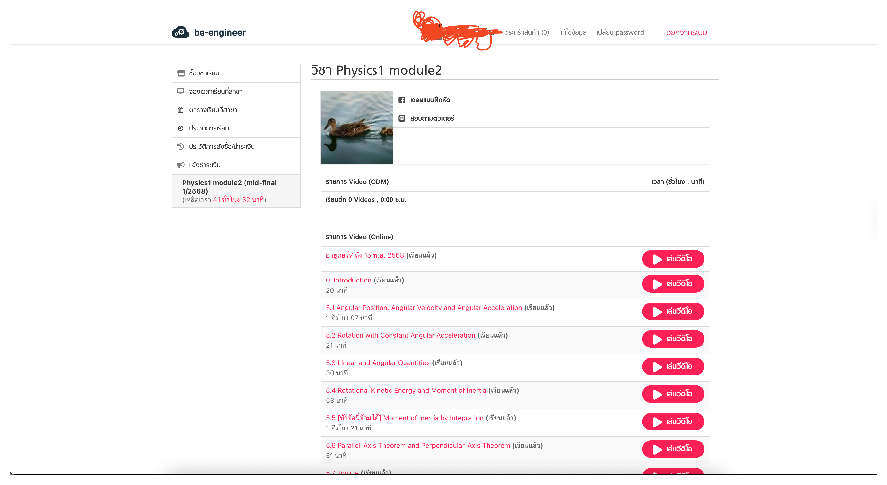

<h3>2) เลือก VDO ซักอัน</h3>
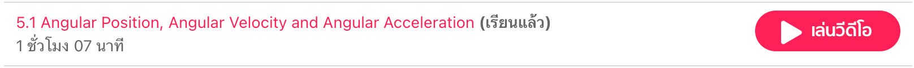

<h3>3) เมื่อเข้ามาเเล้วกด <code>F12</code> เเล้วกดไปที่ <code>Network</code> Tab</h3>
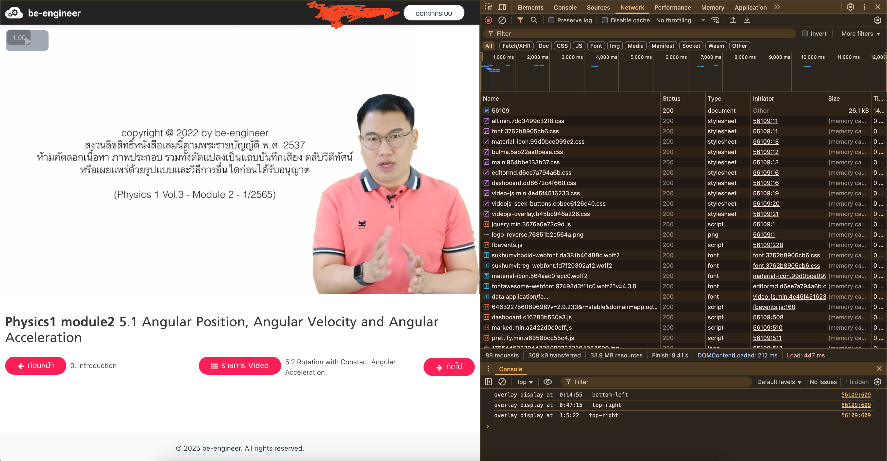

<h3>4) กดเริ่มเล่น VDO หา URL ที่คลายกับในภาพ สามารถกดดู URL เต็มๆ ได้หาที่เป็น <code>.ts</code></h3>
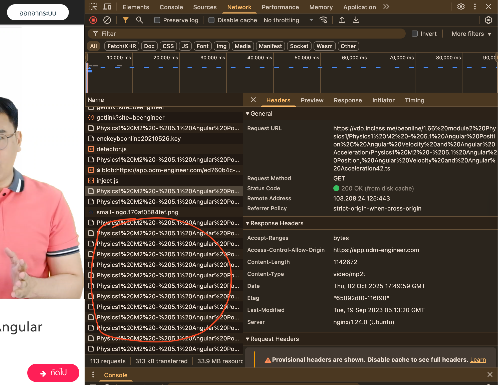

<h3>5 ก็อป URL นั้น เน้่น <code>ต้องเป็น URL ที่ลงท้ายเป็น ....[ตัวเลข].ts เท่านั้น</code></h3>
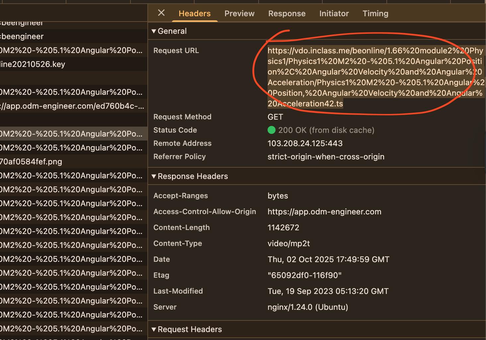

<h3>6 เข้าไปที่ Project จากนั้นหาไฟล์ <code>src/index.ts</code> เเละเลือกเเก้ไข</h3>
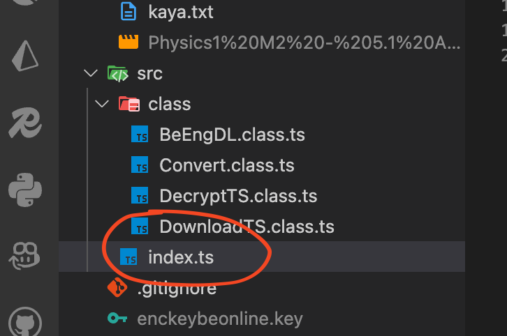

<h3>7 สังเกต Object ที่ชื่อ url ให้วางที่ก็อปมาไปได้เลย</h3>
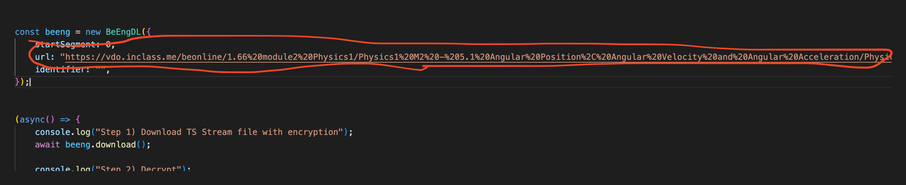

<h3>8 ขยับมาดูที่ท้าย URL ให้หา <code>...[ตัวเลข].ts</code></h3>
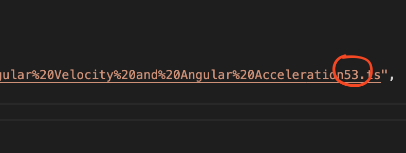

<h3>9 เปลี่ยนจาก [ตัวเลข] เป็นอะไรก็ได้ เช่น <code><<>></code> , <code>[]</code> , <code>{{}}</code> ขอเเค่ให้ดูเเตกต่างมากที่สุด</h3>
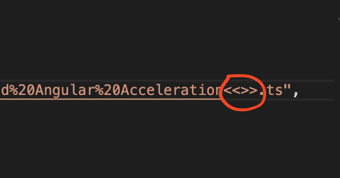

<h3>10 กำหนดว่าเมื่อกี้ได้เปลี่ยน [ตัวเลข] เป็นอะไรไป</h3>
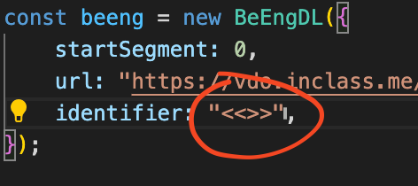

<h3>11 กลับมาที่ Chrome หาไฟล์ที่ชื่อว่า <code>enkeybeonline~~~~~~.key</code></h3>
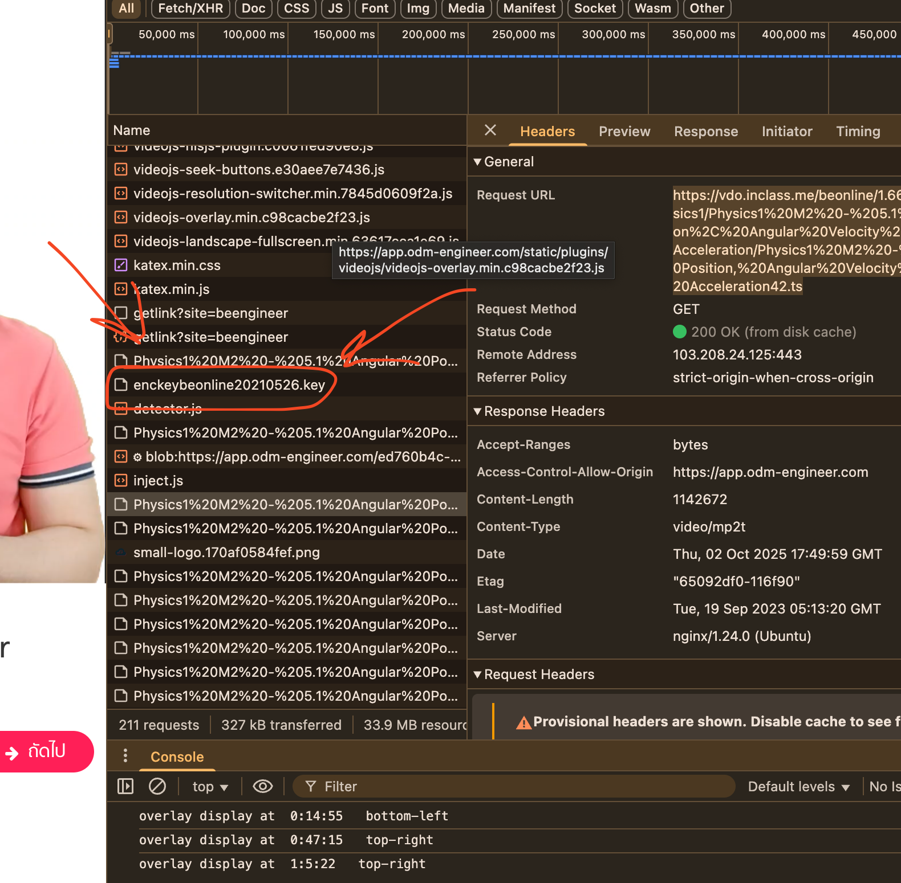

<h3>12 ก็อป URL เต็มๆ ไป</h3>
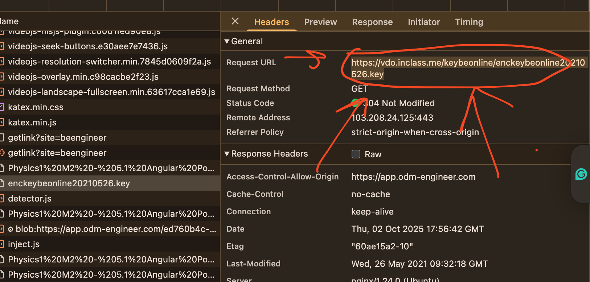

<h3>13 วางลงใน Chrome Search เเล้วโหลดลงเครื่องให้เรียบร้อย</h3>
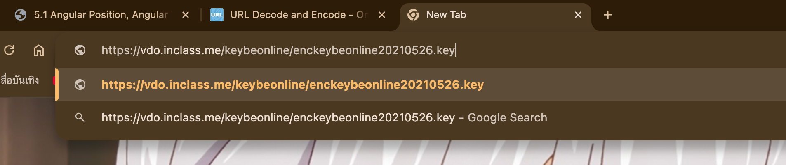

<h3>14 ย้ายไฟล์ <code>enkeybeonline~~~~~~.key</code> ที่โหลดมาไปไว้ที่ <code>root</code> ของ Project</h3>
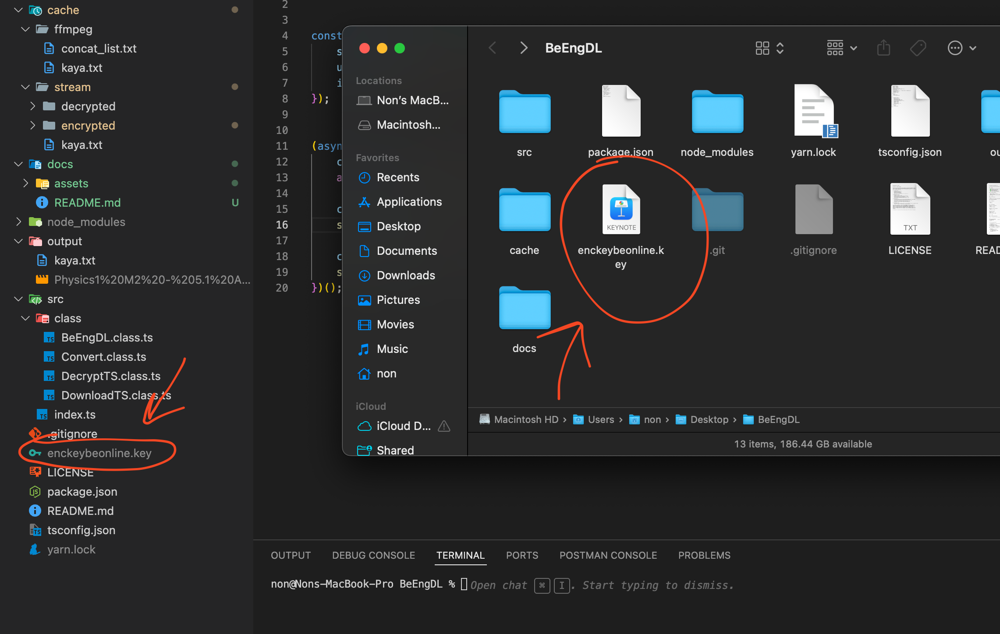

<h3>15 ลองรันโดยใช้คำสั่ง <code>npm run dev</code> หรือ <code>yarn dev</code> (อย่าลืมติดตั้ง dependencies ก่อน)</h3>
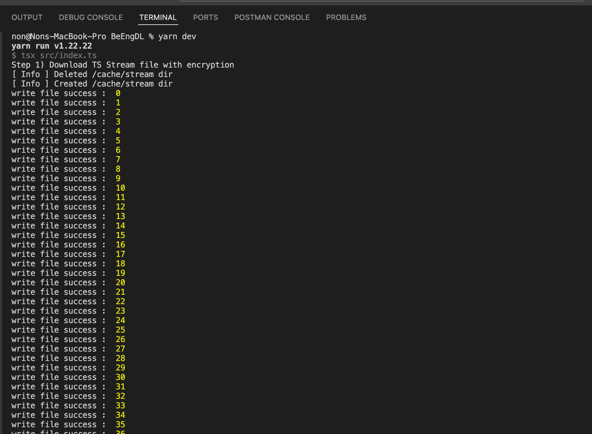

<h3>16 ไฟล์ที่โหลดมาเสร็จเเล้วจะอยู่ใน <code>output/[ชื่อวิชา].mp4</code> ของ Project</h3>
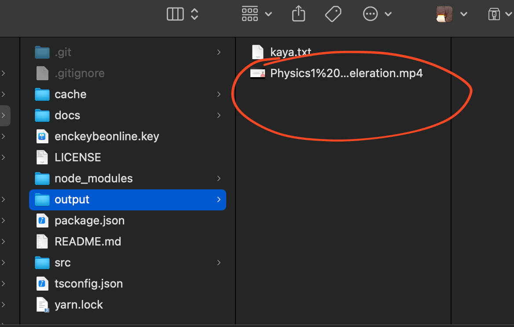

<h3>Happy Hacking, LOL</h3>

<h1>Q & A</h1>

<h3>Q: จะโดนจับได้ไหม?</h3>
<h4>A: ยาก เพราะทุกอย่างเปิดหมด ไฟล์ที่ได้มาก็เเค่โดนเข้ารหัสไว้เฉยๆ เราสามารถ Request ได้โหลดได้ตรงๆ โดยไม่ต้อง Authen อะไรเลย มีไม่กี่ทางที่เขาจะรู้คือ 1. การตรวจสอบ Traffic 2. การวิเคราะห์พฤติกรรมผู้ใช้ 3. เจอ Repo นี้เข้า</h4>

<h3>Q: ใช้โปรเเกรมจับหน้าจอไม่ดีกว่าหรอ?</h3>
<h4>A: 1) ห้ามยุ่งกับคริปขณะจับหน้าถ้าหากอยากได้ความสมบูรณ์ 2) คุณภาพไม่ดีเท่าการดาวน์โหลด 3) ต้องดูให้ครบ 1 - 2 ชม. เพื่อจะได้เเต่ละคริป(เสียเวลามาก) 4) เสียเวลาเรียน Be eng ฟรีๆ</h4>

<h3>Q: ขอดี?</h3>
<h4>A: 1) ไม่ต้องดูครบ 1 - 2 ชม. เพื่อจะได้เเต่ละคริป(เสียเวลามาก) 2) ไม่เสียเวลาเรียนใน Be eng เพราะดูด Streaming จาก Server โดยตรง ไม่ผ่านหน้าเว็บ</h4>

<h3>Q: ทำไมไม่ทำตามกฎไปละเมิดลิขสิทธิ์เขาทำไม ทำไปทำไม?</h3>
<h4>A: ก็กุโง่อ่ะ 😭 ดูครั้งเดียวใช่ว่าจะเข้าใจหนิ เวลาที่ให้เรียนก็จำกัดอีก ไหนจะมีอายุคอสอีก 😭 กุก็ซื้อป่ะ 1600 อ่ะกุก็ขอเก็บเข้าเรียนเผื่อกุเเก้ F เหอะ 😭</h4>